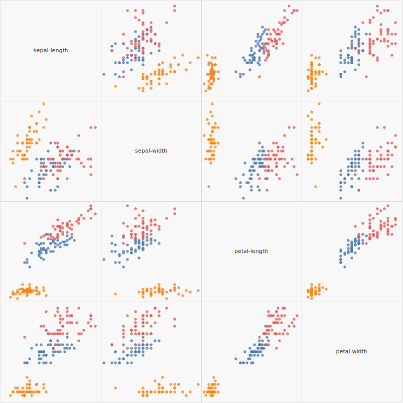

# tech.viz


[](https://clojars.org/techascent/tech.viz)

Simple vega-based visualization of data.


## Usage


Typical expected usage below.  `tech.ml.dataset` is not necessary, it is just used
for processing data in this case.

```clojure
user> (require '[tech.viz.vega :as vega])
nil

;;functions take a sequence of maps as the first argument
user> (vega/scatterplot [{:a 1 :b 2} {:a 2 :b 3}] :a :b)
{:$schema "https://vega.github.io/schema/vega/v5.json",
 :autosize {:type "fit", :resize true, :contains "padding"},
 :width 800,
 :height 450,
 :axes
 [{:scale "x", :grid true, :orient "bottom", :title :a, :domain false}
  {:scale "y", :grid true, :orient "left", :title :b, :domain false}],
 :scales
 ({:zero false,
   :name "x",
   :type "linear",
   :round true,
   :nice true,
   :domain {:data "source", :field :a},
   :range "width"}
  {:zero false,
   :name "y",
   :type "linear",
   :round true,
   :nice true,
   :domain {:data "source", :field :b},
   :range "height"}),
 :marks
 [{:encode
   {:update
    {:fill {:value "#222"},
     :stroke {:value "#222"},
     :opacity {:value 0.5},
     :shape {:value "circle"},
     :x {:field :a, :scale "x"},
     :y {:field :b, :scale "y"}}},
   :from {:data "source"},
   :type "symbol"}],
 :data [{:name "source", :values [{:a 1, :b 2} {:a 2, :b 3}]}]}


user> (require '[tech.ml.dataset :as ds])
nil
user> (require '[tech.v2.datatype.datetime.operations :as dtype-dt-ops])


;;Simple usage
user> (ds/select (ds/->dataset "test/data/spiral-ds.csv") :all (range 5))
test/data/spiral-ds.csv [5 3]:

|     x |      y | label |
|-------+--------+-------|
| 0.041 |  0.075 | green |
| 0.486 |  0.223 | green |
| 0.543 | -0.749 | green |
| 0.154 | -0.376 | green |
| 0.434 | -0.805 | green |
user> (-> (ds/->dataset "test/data/spiral-ds.csv")
          (ds/mapseq-reader)
          (vega/scatterplot "x" "y"
                            {:title "Spriral Dataset"
                             :label-key "label"
                             :background "white"})
          (vega/vega->svg-file "scatterplot.svg"))


;; More involved data processing
user> (ds/select (ds/->dataset "https://vega.github.io/vega/data/stocks.csv")
                 :all (range 5))
https://vega.github.io/vega/data/stocks.csv [5 3]:

| symbol |       date |  price |
|--------+------------+--------|
|   MSFT | 2000-01-01 | 39.810 |
|   MSFT | 2000-02-01 | 36.350 |
|   MSFT | 2000-03-01 | 43.220 |
|   MSFT | 2000-04-01 | 28.370 |
|   MSFT | 2000-05-01 | 25.450 |
user> (as-> (ds/->dataset "https://vega.github.io/vega/data/stocks.csv") ds
      ;;The time series chart expects time in epoch milliseconds
      (ds/add-or-update-column ds "year" (dtype-dt-ops/get-years (ds "date")))
      (ds/filter-column #{2007 2008 2009} "year" ds)
      (ds/update-column ds "date" dtype-dt-ops/get-epoch-milliseconds)
      (ds/mapseq-reader ds)
	  ;;all graphing functions run from pure clojure data.  No batteries required.
      (vega/time-series ds "date" "price"
                        {:title "Stock Price (2007-2010)"
                         :label-key "symbol"
                         :background "white"})
      (vega/vega->svg-file ds "timeseries.svg"))
nil
```


---

#### Iris pairs plot

Raw data as a string:

```clojure
(def iris-raw-str* (delay (slurp "https://archive.ics.uci.edu/ml/machine-learning-databases/iris/iris.data")))
```

Converted to a sequence of maps:

```clojure
(def iris-mapseq
  (->> @iris-raw-str*
       (clojure.string/split-lines)
       (map #(clojure.string/split % #"\,"))
       (map (fn [[sl sw pl pw class]]
              {:sepal-length (Double. sl)
               :sepal-width (Double. sw)
               :petal-length (Double. pl)
               :petal-width (Double. pw)
               :class class}))))
```

And saved as an svg:

```clojure
(let [spec (pairs iris-mapseq
                  [:sepal-length :sepal-width :petal-length :petal-width]
                  {:label-key :class
                   :background :#f8f8f8})]
  (clojure.pprint/pprint spec)
  (vega->svg-file spec "iris-pairs.svg"))
```



## License

Copyright © 2022 TechAscent, LLC

This program and the accompanying materials are made available under the
terms of the Eclipse Public License 2.0 which is available at
http://www.eclipse.org/legal/epl-2.0.
